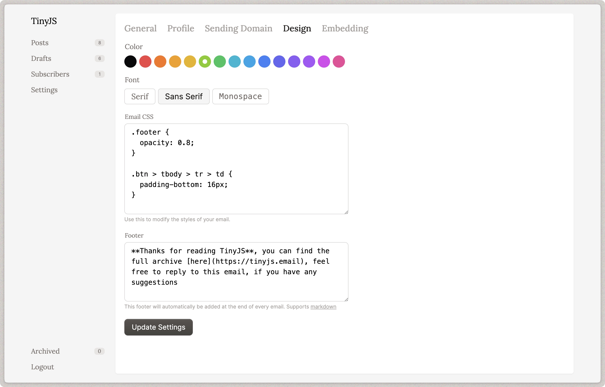

# PicoLetter

Picoletter is a newsletter app for independent bloggers and writers. It uses [Resend](htttps://resend.com) APIs to send emails. With their really generous free tier, you could run your newsletter on a $5 VM on DigitalOcean or Hetzner virtually for free.

 More Screenshots 

This is beta software, you can use it in production if you're feeling like going on a adventure, meanwhile here are the list of things that work and things that are pending

## Features

- Run multiple newsletter from the same app
- Subscription, confirmation & unsubscription flow
- Schedule newsletter for sending
- Custom sending domains
- Handle bounces and complains to ensure good reputation
- Embeddable forms for subscription

### Pending features

- [ ] Public archive
- [ ] Better rate limiting for embed forms
- [ ] Subscriber import & export
- [ ] Subscriber reminders
- [ ] Subscriber labels and cohorts

## Stack

- Ruby on Rails
- PostgreSQl
- SolidQueue
- Resend

The backend is written in Rails with PostgreSQL as the DB. [SolidQueue](https://github.com/rails/solid_queue) is used to run background jobs.

We use [Resend](https://resend.com/) for emails, plain old SMTP won't work here, since we need to send emails in bulk. Comparing most providers available, Resend struck the balance perfectly in terms of simplicity and pricing. For most users hosting this on their own, their free tier should suffice. At the moment there's no plans to add support for any other provider

## Deployment

Deployment will be done with [slick-deploy](https://github.com/scmmishra/slick-deploy) and [kamal-deploy](https://kamal-deploy.org) as an alternative option.

A lot of work is pending in this department, I am building slick-deploy along with this app, so it might be slow.
